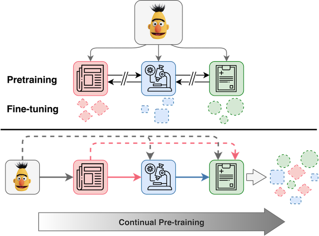

# An Empirical Investigation Towards Efficient Multi-Domain Language Model Pre-training



This repository accompanies our work on catastrophic forgetting mitigation for large scale language model pre-training.  The work appears in the proceedings of the 2020 EMNLP main conference.

https://arxiv.org/pdf/2010.00784.pdf

In this repo we provide instructions to pre-train using Fairseq RoBERTa (v0.8.0).  Specifically this provides support forlearning rate control (LRC), and elastic weight consolidation (EWC) as described in our paper.

If you find the paper or code useful, please cite our paper: 
```
@misc{arumae2020empirical,
      title={An Empirical Investigation Towards Efficient Multi-Domain Language Model Pre-training}, 
      author={Kristjan Arumae and Qing Sun and Parminder Bhatia},
      year={2020},
      eprint={2010.00784},
      archivePrefix={arXiv},
      primaryClass={cs.CL}
}
```

## Pre-training with Mitigation
Fortunately all pre-processing for this work follows existing guidelines from Fairseq RoBERTa, covered [here](https://github.com/pytorch/fairseq/blob/master/examples/roberta/README.pretraining.md).  We also make use of many of the default settings for pre-training (e.g. learning rate and batch size).  The largest change to make for new data is to determine data size for which to choose a warmup ratio.

### Elastic Weight Consolidation  
For EWC users will need to pre-process data to be used for the Fisher information matrix (FIM) generation.  You should already have a train/test/validation split aleady generated of the current domain.  For any previous domain, we suggest a sampled down version of the training or validation data and processed into a single set (i.e. `.bpe` and `.idx`).  This repo can easily be tooled to load a saved FIM, although we did not incorporate this currently. 

```bash
TOTAL_UPDATES=10000 #update this to reflect your data size.
WARMUP_UPDATES=1000
PEAK_LR=0.0005
TOKENS_PER_SAMPLE=512
MAX_POSITIONS=512
MAX_SENTENCES=4
UPDATE_FREQ=64

DATA_DIR=/path/to/prorocceed/data #training and fisher generation data
FISHER_SUBSET=fisher_split #name of FIM generation split within DATA_DIR
FISHER_LAMBDA=1.0 #Fisher lambda parameter
RESTORE_PATH=/path/to/previous/domain/model.pt #Starting point for training.  Generally the previously saved model.pt file. 
SAVE_PATH=/save/checkpoint/path #path to save current model checkpoints.  Keep in mind each checkpoint is roughly 1GB of storage.

fairseq-train  $DATA_DIR \
	       --task masked_lm --criterion masked_lm \
	       --arch roberta_base --sample-break-mode complete --tokens-per-sample $TOKENS_PER_SAMPLE \
	       --optimizer adam --adam-betas '(0.9,0.98)' --adam-eps 1e-6 --clip-norm 0.0 \
	       --lr-scheduler polynomial_decay --lr $PEAK_LR --warmup-updates $WARMUP_UPDATES --total-num-update $TOTAL_UPDATES \
	       --dropout 0.1 --attention-dropout 0.1 --weight-decay 0.01 \
	       --max-sentences $MAX_SENTENCES --update-freq $UPDATE_FREQ \
	       --restore-file $RESTORE_PATH  \
	       --max-update $TOTAL_UPDATES --log-format simple --save-interval-updates 1000 --keep-interval-updates -1 \
	       --save-dir $SAVE_PATH --fisher_lambda $FISHER_LAMBDA --train_subset_tem $FISHER_SUBSET
```

### Learning Rate Control
For LRC no previous data is needed, and only a single additional hyperparameter needs to be tuned.

```bash
TOTAL_UPDATES=10000
WARMUP_UPDATES=1000
PEAK_LR=0.0005
TOKENS_PER_SAMPLE=512
MAX_POSITIONS=512
MAX_SENTENCES=4
UPDATE_FREQ=64

DATA_DIR=/path/to/prorocceed/data
RESTORE_PATH=/path/to/previous/domain/model.pt 
SAVE_PATH=/save/checkpoint/path
RHO=2.6 #decay rate for LRC

fairseq-train  $DATA_DIR \
	       --task masked_lm --criterion masked_lm \
	       --arch roberta_base --sample-break-mode complete --tokens-per-sample $TOKENS_PER_SAMPLE \
	       --optimizer adam --adam-betas '(0.9,0.98)' --adam-eps 1e-6 --clip-norm 0.0 \
	       --lr-scheduler polynomial_decay --lr $PEAK_LR --warmup-updates $WARMUP_UPDATES --total-num-update $TOTAL_UPDATES \
	       --dropout 0.1 --attention-dropout 0.1 --weight-decay 0.01 \
	       --max-sentences $MAX_SENTENCES --update-freq $UPDATE_FREQ \
	       --restore-file $RESTORE_PATH \
	       --max-update $TOTAL_UPDATES --log-format simple --save-interval-updates 1000 --keep-interval-updates -1 \
	       --save-dir $SAVE_PATH \
	       --use_ulmfit --decay_rate_lrc $RHO
```

## Fine-tuning

Here we provide a sample fine-tuning script to be used with Fairseq (v0.8.0), not this repo.  This is on [BioASQ](http://www.bioasq.org/) task 7b.  In our paper we treated this task as a binary classification following [BLURB](https://arxiv.org/abs/2007.15779).

The pre-training scripts will generate a `checkpoint_best.pt` file, and this is likely most useful to load under `ROBERTA_PATH`.

```bash
TOTAL_NUM_UPDATES=3020  # 10 epochs through BioASQ for bsz 32
WARMUP_UPDATES=300
LR=1e-05
HEAD_NAME=bioasq_head
NUM_CLASSES=2 # QA treated as a binary classification task
MAX_SENTENCES=8
ROBERTA_PATH=/save/checkpoint/path/model.pt
SAVE_PATH=/save/finetune/checkpoint/path
DATA_PATH=/data/path/

fairseq-train $DATA_PATH \
		    --restore-file $ROBERTA_PATH \
		    --max-positions 512 \
		    --max-sentences $MAX_SENTENCES \
		    --max-tokens 4400 \
		    --task sentence_prediction \
		    --reset-optimizer --reset-dataloader --reset-meters \
		    --required-batch-size-multiple 1 \
		    --init-token 0 --separator-token 2 \
		    --arch roberta_base \
		    --criterion sentence_prediction \
		    --classification-head-name $HEAD_NAME \
		    --num-classes $NUM_CLASSES \
		    --dropout 0.1 --attention-dropout 0.1 \
		    --weight-decay 0.1 --optimizer adam --adam-betas "(0.9, 0.98)" --adam-eps 1e-06 \
		    --clip-norm 0.0 \
		    --lr-scheduler polynomial_decay --lr $LR --total-num-update $TOTAL_NUM_UPDATES --warmup-updates $WARMUP_UPDATES \
		    --fp16 --fp16-init-scale 4 --threshold-loss-scale 1 --fp16-scale-window 128 \
		    --max-epoch 10 \
		    --best-checkpoint-metric accuracy --maximize-best-checkpoint-metric \
		    --shorten-method "truncate" \
		    --find-unused-parameters \
		    --update-freq 4 --save-dir $SAVE_PATH
```


## Notes

Be sure to use `--reset-dataloader --reset-lr-scheduler --reset-optimizer` when appropriate.

For experience replay in our paper we do not use this package, but the built in data source mixing for Fairseq:  
```bash
TOTAL_UPDATES=35000  
WARMUP_UPDATES=10000
PEAK_LR=0.0005
TOKENS_PER_SAMPLE=512
MAX_POSITIONS=512
MAX_SENTENCES=8
UPDATE_FREQ=32
DATA_DIR=/path/to/your/data/ # name multiple datasets as train.txt, train1.txt, train2.txt 
SAVE_DIR=/path/to/save/checkpoints/

python -W ignore train.py \
       $DATA_DIR \
       --fp16 \
       --task masked_lm \
       --criterion masked_lm \
       --arch roberta_base \
       --sample-break-mode complete \
       --tokens-per-sample $TOKENS_PER_SAMPLE \
       --optimizer adam \
       --adam-betas '(0.9,0.98)' \
       --adam-eps 1e-6 \
       --clip-norm 0.0 \
       --lr-scheduler polynomial_decay \
       --lr $PEAK_LR \
       --warmup-updates $WARMUP_UPDATES \
       --total-num-update $TOTAL_UPDATES \
       --dropout 0.1 \
       --attention-dropout 0.1 \
       --weight-decay 0.01 \
       --max-sentences $MAX_SENTENCES \
       --update-freq $UPDATE_FREQ \
       --max-update $TOTAL_UPDATES \
       --log-format simple \
       --save-interval-updates 500 \
       --keep-interval-updates -1 \
       --save-dir $SAVE_DIR 
``` 
